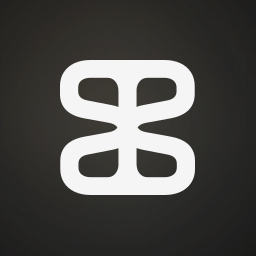

# Strange Texo: Design System

## 1. Core Identity & Philosophy

The design system is built for an avant-garde, experimental tech brand that operates as a conduit between the tangible and the intangible. Our core mission is creating connections and pipelines between physical and virtual ideas.

- **Personality:** Experimental, grounded, visionary, precise, technical sense of humor, geek.
- **Values:** Ethics-first innovation, seamless real-time interaction, spatial intelligence.
- **Tone:** Professional, but speculative. Think architect meets futurist. We use first-person plural ("we design," "we prototype").

## 2. Brand & Style

The chosen style is **Atmospheric & Immersive**. This approach leverages massive typography and a raw, deeply spatial aesthetic. By utilizing a dark void illuminated by a **Vibrant Orange** and **Vibrant Blue** palette against a **Deep Background** (#111111) foundation, the system evokes a sense of "volumetric space"—highly polished and speculative. While the UI relies on structural integrity and geometric precision, it uses monospaced typography to suggest a code-centric, technical intelligence.

## 3. Colors

The palette is heavily weighted towards deep darkness, allowing our specific accent colors and "light blobs" to cut through the void, guiding the user's attention.

- **Deep Background (#111111):** The canvas of our brand, representing the empty space where physical and virtual meet.
- **Primary Interaction (Vibrant Orange - #FF8F00):** Used strictly for critical paths and text highlights.
- **Secondary Accents (Light Blue - #BFE4FF & Vibrant Blue - #0076CC):** Providing a cool, functional contrast.
- **Primary Text (#F5F5F5):** Off-white for maximum legibility.
- **Light:** Not just a state; it is a structural highlight used as an atmospheric conduit.

## 4. Typography

Typography is the core visual engine of this design system. We use **JetBrains Mono** exclusively for web to emphasize the technical, code-centric nature of the brand. (For print usage, Bai Jamjuree is utilized).

- **Display Scales:** Headings are massive, tightly kerned, and structurally sound. Use the "ExtraBold" (800) weight to create a wall of text that commands attention without clutter.
- **Labels:** Use uppercase for labels and small metadata to create a "data-heavy," analytical look.
- **Micro-Copy:** Maintain a clear 14px minimum for utility text. The monospaced nature ensures every character has its own space, reflecting our value of precision.
- **Alignment:** Use left-alignment religiously. Avoid center-alignment to maintain the structured feel of a digital pipeline.

## 5. Layout & Spacing

The layout philosophy is a **Spatial & Uncluttered Grid** that prioritizes clarity and focus.

- **Desktop:** A 12-column grid with wide 64px margins and 24px gutters. The layout must remain exceptionally clean—absolutely no visual noise or cluttered backgrounds.
- **Mobile:** A 4-column grid with 24px margins.
- **Rhythm:** All spacing must be a multiple of 8px. Use generous vertical whitespace to create a sense of scale and emptiness, allowing our signature light blobs and stark typography to guide the user naturally through the space.

## 6. Elevation & Depth (The Signature Effect)

This system rejects traditional drop shadows in favor of **Volumetric Lighting** and **Atmospheric Depth**:

- **Light Scattering:** Elevation is conveyed by emulating light scattering through dense fog. Use geometric shapes filled with accent colors (Light Orange or Light Blue) and heavily blur them behind containers to lift them off the canvas.
- **Glowing Entities:** These glowing blobs are functional, drawing attention across the void rather than just decorating it. Whenever possible, these light effects should be animated to feel alive and volumetric.
- **Tonal Stepping:** Use slightly lighter neutral tones (e.g., #1F1F1F) for secondary "sunken" surfaces or structured code blocks to distinguish them from the deep background void.

### Examples of Our Effect
* 
* 
* 
* 

## 7. Shapes

The shape language is **Geometric & Functional**.

We rely on geometric precision to house content, heavily contrasting with the soft, ethereal blur of our light blobs behind them. Primary elements—buttons, cards, and input fields—feature a consistent 8px (0.5rem) corner radius to provide a modern, highly engineered software feel. Images and assets should be tightly composed, often showing technical details or wide architectural spaces, contrasting rigid edges with the soft, glowing background elements.

## 8. Components

### Buttons
- **Primary:** Solid Vibrant Orange (#FF8F00) background, Deep Background (#111111) text, 8px radius. On hover, the button emits a soft, heavily blurred orange glow behind it.
- **Secondary:** Transparent background, 1px Vibrant Blue (#0076CC) border, Vibrant Blue text, 8px radius.

### Input Fields
- **Default:** Deep Background fill with a 1px soft outline (#555555) and an 8px radius. Text is off-white (#F5F5F5).
- **Focus:** The border turns Vibrant Blue or Vibrant Orange, and a very subtle glowing light blob is activated behind the field to indicate focus.

### Cards
- Deep Background (#111111) fill or slightly elevated surface (#1F1F1F). 1px Outline (#555555) border with an 8px corner radius.
- Cards can be highlighted by placing a blurred Light Blue or Light Orange atmospheric glow behind the container.

### Chips/Tags
- Small, geometric blocks with an 8px corner radius and 1px border. Use the `label-caps` typography style to feel like a terminal output.

### Unique Component: "The Signature Divider"
- A 1px horizontal line that extends to the edge of the viewport, serving as a crisp, technical division between physical sections, often accompanied by a faint, localized atmospheric glow.

## 9. Photography & Imagery

Photography is our preferred medium for conveying complex ideas.

- **Placement:** If there is an image to show, it **always goes on the left side** of the page.
- **Subject Matter:** We prefer tight shots of technical details (machinery, robotics, 3D printing) or wide shots of architectural spaces (warehouses, brutalist structures).
- **Clarity & Tone:** Spaces must be easily readable with no visual noise. The overall tonal average of our photography should lean towards **browns or grays**.
- **Representing Scale:** When showing the massive scale of an idea or space, use the human figure. Humans must **always be shown as a black silhouette** to maintain the anonymous, universal, and atmospheric tone of the brand.

#### Examples: Good Base vs. Deviations
**Good Base Photography**
* 
* 

**Good Deviations (Color & Tone)**
* 
* 

**Bad Deviations (To Avoid)**
* 

#### Examples of Human Figure
* 
* 

## 10. Logos

- Maintain high contrast. Use appropriate Light/Dark theme variations (Isologo/Isotipo) based on the background color.

### Main Icons
* 
* 

### Isologos & Isotipos (Theme-Specific)
* **Dark Theme:**
  * 
  * 
* **Light Theme:**
  * 
  * 
