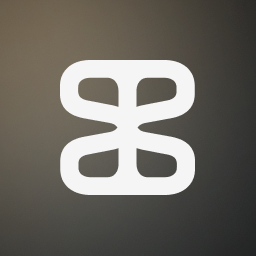

# STRANGE TEXO: Brand Guidelines

> **Brand Director's Note:**  
> Welcome to the official brand guidelines for **STRANGE TEXO ⌘**. Our brand exists at the intersection of reality and the digital realm. Every visual choice we make must reinforce our core mission: creating *connections and pipelines between physical and virtual ideas*. Consistency, atmosphere, and artistic integrity are non-negotiable.

---

## 1. Core Identity & Philosophy

**STRANGE TEXO** is about bridging worlds. Our visual identity should always feel like a conduit between the tangible (machinery, architecture, raw materials) and the intangible (light, code, virtual spaces).

*   **Tagline / Core Concept:** Connections between physical and virtual. 
*   **Vibe:** Atmospheric, technical, artistic, and deeply immersive.

*   **Core emotion:** Curiosity. There´s something there. I´m not seeing it, but they do.

*   **Core Identity** 
    *   **Industry Focus:** Urban simulation, immersive training, AI-integrated digital twins, spatial computing
    *   **Personality:** Experimental, grounded, visionary, precise, technical sense of humor, geek
    *   **Values:** Ethics-first innovation · Seamless real-time interaction · spatial intelligence

*   **What we do** 
    *   Connect the physical and the virtual.
    *   The pipeline is the product. 
    *   We craft tools,3d environments and experiences for people  start-ups and companies to thrive in a hybrid world.

*   **Services** 
    *   3d environment design
    *   Tools development
    *   Pipeline integration
    *   Spatial computing
    *   AI-integrated digital twins
    *   Immersive training
    *   Urban simulation

*   **Why we do it** 
    *   Because it´s interesting and fun for us 
    *   Because we believe that seamless connection between different domains will be determining factor of success    

*   **How we express ourselves**
    *   Professional, but speculative.

    *   Think architect meets futurist. 
    *   Use first-person plural (“we design,” “we prototype,” “we integrate”) to reflect collaborative intelligence.

    *   Example:
    We build synthetic cities you can walk through.
    We prototype futures. Then we let people live in them.

*   **Our manifesto**    
    * **The Ultimate Purpose**
        * The core objective is continuous improvement—discovering what is best for oneself, for society, and, above all else, for our children.

    * **Self-Improvement:** Intellectually, learning to "read the world" and understand its systems. Physically, the strength to lift heavy burdens and the endurance to sustain effort for hours.
    * **Societal Contribution:** Empathy, the profound ability to step into another person's shoes and understand their perspective.
    * **Legacy for Our Children:** To deeply know oneself and to express clearly.

    These pillars are deeply interconnected and they must all be present.

    * **To read the world:** Design, Finance, and Programming.
    * **To step into another's shoes:** Psychology and Neuroscience.
    * **To know oneself:** Philosophy and Neuroscience.
    * **To express oneself:** Poetry.

---

## 2. Color Palette

Our color palette is heavily weighted towards deep darkness, allowing our specific accent colors and "light blobs" to cut through the void, guiding the user's attention.

### Foundational Colors
*   **Deep Background (#111111 | RGB 17, 17, 17):** The canvas of our brand. **Most of the screen should be this color.** It represents the empty space where physical and virtual meet.
*   **Primary Text (#F5F5F5 | RGB 245, 245, 245):** Crisp, off-white for maximum legibility against the deep dark background.

### Accent & Highlight Colors
These colors are used sparingly to highlight text or to create our signature light blobs.
*   **Vibrant Orange (#FF8F00):** Used strictly to highlight text.
*   **Light Orange/Peach:** Used to highlight text and for generating our atmospheric "light blobs."
*   **Light Blue (#BFE4FF | RGB 191, 228, 255):** Used to highlight text and for generating our atmospheric "light blobs."
*   **Vibrant Blue (#0076CC | RGB 0, 118, 204):** Used strictly to highlight text.

---

## 3. "Our Effect" (The Signature Look)

A defining characteristic of the STRANGE TEXO visual identity is our signature lighting effect. 

*   **The Concept:** We emulate light scattering through dense fog. 
*   **The Inspiration:** Heavily influenced by the atmospheric and light-based installation work of artist Olafur Eliasson.
*   **The Execution:** We use geometric shapes filled with one of our accent colors (Light Orange or Light Blue) and heavily blur them. 
*   **Purpose:** These glowing entities are not just decorative; they are functional. They are used deliberately to guide the viewer's attention across the canvas.
*   **Motion:** Whenever possible, these light effects should be animated to feel alive and volumetric.

### Examples of Our Effect
* 
* 
* 
* 

---

## 4. Photography Guidelines

Photography is our preferred medium for conveying complex ideas. It grounds our virtual concepts in physical reality.

### Composition & Layout
*   **Placement:** If there is an image to show, it **always goes on the left side** of the page.
*   **Clarity:** Spaces must be easily readable. Absolutely no visual noise or cluttered backgrounds. If shooting technical details, the background must remain plain.

### Color Grading & Tone
*   **Average Color:** The overall tonal average of our photography should lean towards **browns or grays**. This muted, grounded palette contrasts beautifully with our vibrant, ethereal "light blobs."

### Subject Matter & Artistic Flair
*   **Technical & Spatial:** We prefer tight shots of technical details (machinery, robotics, 3D printing) or wide shots of architectural spaces (warehouses, brutalist structures).
*   **Artistic Identity:** Art is a crucial part of who we are. Every photograph used must possess a distinct "artistic flair." It should never feel like a generic stock photo; it must feel curated, deliberate, and sculptural.

#### Examples: Good Base vs. Deviations
**Good Base Photography**
* 
* 

**Good Deviations (Color & Tone)**
* 
* 

**Bad Deviations (To Avoid)**
* 

### Representing Scale (The Human Element)
*   There will be cases where the massive scale of an idea, physical space, or virtual projection needs to be represented.
*   **The Rule:** The preferred way to show scale is by using the human figure.
*   **The Execution:** Humans must **always be shown as a black silhouette**. This ensures high contrast against light sources and maintains the anonymous, universal, and atmospheric tone of the brand.

#### Examples of Human Figure
* 
* 

---

##  5. Typography
    Jet Brains Mono for web usage
    Bai Jamjuree for print usage

## 6. Logo 

### Main Icons
* 
* 

### Isologos & Isotipos (Theme-Specific)
Always use the appropriate variant based on the background color to maintain contrast and legibility.
* **Dark Theme:**
  * 
  * 
* **Light Theme:**
  * 
  * 